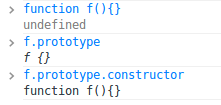

#
---
layout: default_post
title: javascript初入爱河
categories: Archive
permalink: /Archive/javascript-OOP.html
---

这题目有点情怀，其实就是说javascript面向对象....

javascript和传统的具有类的面向对象程序语言不同，他是通过原型`prototype`实现面向对象编程，一点点见解蜻蜓点水，抛砖引玉。

首先说起面向对象一定会想到三大特征封装、继承、多态。

#封装

封装即隐藏对象的属性和实现细节，仅对外提供访问方式。这里我姑且理解为创建对象，在javascript创建对象有很多种方式，例如工厂模式、构造函数、原型等。但是每种方法都有各自的缺点。

+ 工厂模式

<pre><code>
function f(){
    var obj = {}
    obj.name = 'name'
    return obj
}
</code></pre>

工厂模式虽然解决了创建对象的问题，但是也仅仅是解决了创建对象的问题，执行函数创建对象的都是在函数内新建一个对象，这样的对象很明显不能完成面向对象的使命。

+ 构造函数

构造函数其实也是函数，只是通过`new`操作符可以创建一个对象。

<pre><code>
function F(){
    this.name = 'name'
    this.say = function(){console.log('hello')}
}

obj = new F()
</code></pre>

看起来不错，比刚刚好一点。但是实例化对象还是没有共享属性。

+ 原型

关于原型的具体介绍，在继承那一部分详细介绍，看下面代码，就可以发现他的魅力，重要的是有原型属性的构造函数可以实现共享属性和共享方法。

<pre><code>
function F(){}
F.prototype.name = 'name'
F.prototype.say = function(){console.log('hello')}

a = new F()
b = new F()
</code></pre>

这个构造函数实例化的对象，有了共享属性，共享方法，确切的说a，b两个对象的方法和属性都只想的是同一个变量或方法。

上例稍加改造就可以实现一个最常用的对象构造函数

<pre><code>
function F(){this.name = 'name'}
F.prototype.age = 0
F.prototype.say = function(){console.log(this.name)}

a = new F()
b = new F()

a.name = 'niu'
b.name = 'yi'
alert(a.say() == b.say()) // false

alert(b.age) // 0
a.age = 22
alert(b.age) // 22
</code></pre>

Ps:在javascript对象中也可以实现私有变量，即通过作用域变量和闭包。以上为最基本的创建对象方式，其他还有寄生模式、稳妥模式等（详见javascript高级程序设计第六章）。

#继承

这里补一下上一部分的原型，有一段`javascript高级程序设计第六章`的引用

> > 理解原型对象
> >
无论什么时候，只要创建一个新函数，就会根据一组特定的规则为该函数创建一个prototype属性，这个属性指向函数的原型对象。在默认情况下，所有原型对象都会自动创建一个constructor（构造函数）属性，这个属性包含一个执行prototype属性所在函数的指针......

再上一段引用

>> 原型链
>> 
简单回顾一下函数、原型和实例的关系：每个构造函数都有一个原型对象，原型对象都包含一个指向构造函数的指针，而实例都包含一个指向原型对象的内部指针。那么，假如我们让原型对象等于一个类型的实例，结果会怎样？显然，此时的原型对象将包含一个指向另一个原型的指针，相应地，另一个原型中也包含着一个指向另一个构造函数的指针...

通过下面例子理解加深理解两个概念

这个例子中我定义了三个构造函数，分别是F、Son、Grandson。正如他们的命名一样，通过原型实现他们的继承，具体实现就是将F的实例赋给Son的原型，Son的实例赋给Grandson的原型，结合原型链来理解一下。

已知每个实例包含一个指向原型对象的指针，me即`new Grandson()`，作为Grandson的一个实例，包含着一个指向Grandson的原型对象的指针。在Grandon中他的原型对象是`new Son()`，而new Son()作为Son的一个实例，他同样也包含着一个指向Son原型对象的指针。类推，直到Object对象，这样就构成了原型链。

如图中，打印并展开Grandson.prototype，可以看到一些详细的属性，他是通过一个叫做`__proto__`的只读属性向上回溯的，直到Object。通过这个查找机制，me对象就继承了Grandson、Son、F、Object的全部属性和方法。

在最后也可以看到，Grandson、Son、F、Object都是me的原型。

#多态

理解了继承，多态就不在话下了，这里写一道变身的[面试题](http://www.w3cfuns.com/thread-1936-1-1.html)。

小贤是一条可爱的小狗(Dog)，它的叫声很好听(wow)，每次看到主人的时候就会乖乖叫一声(yelp)。A、B和Dog一样，原来也是两条可爱的小狗，可是突然有一天都疯了(MadDog)，A一看到人就会每隔半秒叫一声(wow)地不停叫唤(yelp)，B一看到人就会每隔一秒叫一声(haha wow)地不停叫唤(yelp)

<pre><code>
function Dog(){
    this.wow = function(){
		console.log('wow')
    }
    this.yelp = function(){
		this.wow()
	}
}
function MadDogA(time){
	var self = this
	this.time = time
	this.yelp = function(){
		setInterval(function(){
			self.wow() // this === window
		}, this.time)
	}
}

function MadDogB(time){
	var self = this
	this.time = time
	this.yelp = function(){
		setInterval(function(){
			console.log('haha')
			self.wow() // this === window
		}, 1000)
	}
}
MadDogA.prototype = new Dog()
MadDogB.prototype = new Dog()

A = new MadDogA(500)
B = new MadDogB(1000)
A.yelp()
B.yelp()
</code></pre>