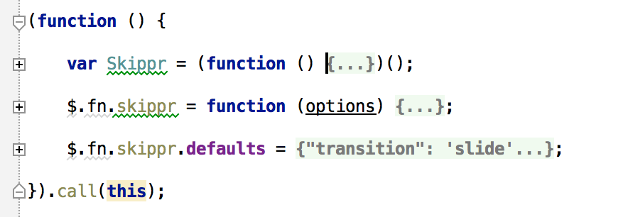

最近对前端比较感兴趣，推荐一款不错的轮播插件，[skippr](https://github.com/austenpayan/skippr)。

喜欢skippr，一方面是特别好用，用起来特别简单。另一方面代码特别干净，也特别适合学习。

下面简要看一看skippr的代码。

<pre><code>
   $.fn.skippr = function (options) {

        var instance;

        instance = this.data('skippr');
        if (!instance) {
            return this.each(function () {
                return $(this).data('skippr', new Skippr(this,options));
            });
        }
        if (options === true) return instance;
        if ($.type(options) === 'string') instance[options]();
        return this;
    };

    $.fn.skippr.defaults = {
        transition: 'slide',
        speed: 1000,
        easing: 'easeOutQuart',
        navType: 'block',
        childrenElementType : 'div',
        arrows: true,
        autoPlay: false,
        autoPlayDuration: 5000,
        keyboardOnAlways: true,
        hidePrevious: false,
        imgArray : null,
        logs: false
       
    };
</code></pre>

> $.fn是指jquery的命名空间，加上fn上的方法及属性，会对jquery实例每一个有效

skippr作为jquery的一个插件来实现，入口在`return $(this).data('skippr', new Skippr(this,options))`

Skippr是个构造函数，匿名函数来实现，防止了作用域被污染。

首先看看构造函数Skippr构造函数的属性和方法
<pre><code>
function Skippr(element, options) {

    var _ = this,
        timer;
        _.settings = $.extend($.fn.skippr.defaults, options); 
        _.$element = $(element);
        _.$parent = _.$element.parent();
        _.$photos = _.$element.children();
        _.count = _.$photos.length;
        _.countString = String(_.count);
        _.touchOnThis = false;
        _.previousTouchX = null;
        _.swipeDirection = null;
        _.init();
    
}
</code></pre>

settings Skippr 一些基本的参数

$element        轮播的目标DOM元素

$parent         目标DOM的父亲元素

$photot         目标DOM子元素

count           轮播图片的数量

countStringa    轮播图片数量字符串

touchOnthis     是否touch

previousTouchX  代码中注释说
                // Record the current xcoord to be used as reference in
                // touchmove event listener.

swipeDirection  轮播滑动方向

init()          初始化方法

##init

从init方法才真正进入skippr的核心，执行了setup、navClick、arrowClick、resize、keyPress方法。根据是否自动播放以及检测是否触屏，选择执行autoPlay、autoPlayPause和touch方法。

这些方法大多是构造轮播需要的dom结构，以及一些列的事件监听。

##setup

setup方法主要进行dom的结构的构造，根据`childrenElementType`为img或array有两种不同构造方法，这在使用skippr的时候变得非常灵活。同时轮播的切换也有两种方式fade和slide，如果开启幻灯片切换，也就是slide，会执行setupSlide方法。点击切换，也有两种方式，导航切换，和剪头切换。默认箭头切换可选择开启，而导航切换必开启。这一点也非常容易改变，他们的控制方法分别是navBulid和arrowBulid。

##setupSlider

幻灯片切换的设置方法。实现幻灯片切换skippr是通过绝对位置设置每张图片的位置。这个方法正是做这个工作。

##navBuild

构建navClick点击的dom，每张图片都有自己的`data－slide`，当前活动的nav加入`skippr-nav-element-active`class。

##arrowBuild

构建arrowClick点击的dom，左右箭头都有一个data-slider，值分别为左图和右图的data－slider。

##navClick

导航点击切换图片。调用change(element)方法，把jquery选择器选中的dom对象作为参数传给change。

##arrowClick

点击剪头切换图片。和navClick一样调用change方法。

##change

change方法是skippr的核心，实现了轮播最重要的切换。因为在执行到这一步之前，skippr已经做了足够的dom操作。class比如skippr-nav-item、skippr-arrow、skippr-previous、skippr-next、skippr-nav-element、skippr-nav-item、skippr-nav-element-block、skippr-nav-element-active等都是skippr依赖的，不过这些都是skippr在navBuild和arrowBuild的时候自动添加的，我们不用关注过多。另外data-slider也是识别活动图片和前后图片重要的属性。
切换方法若为fade，直接用jquery的fadeIn和fadeOut方法以及z-index属性搞定；若切换方法为slider，依赖velocityjs滑动切换。

##hidePrevious

初始化出来，是否隐藏左箭头。可是试试关闭，看看效果。原本没搞明白这个是干嘛的。。。

##resize

重新调整图片的绝对位置。这个方法注释掉貌似也没有问题，发现问题再补充。。。

##keyPress

键盘监听，触发keydown事件。键盘 <－ 和 －> 的键值码分别为37和39。skippr用的是e.which, 这个再IE应该是有问题的，以前遇到过问题，当下没有IE, 也没做测试。

##autoPlay

自动播放，设置一个定时器自动执行change方法

##autoPlayPause

暂停自动播放，当鼠标放到图片上，清除定时器，鼠标拿开回调重新设置定时器。同时绑定了一个焦点事件。

touch

应用于触摸屏，触发touchend事件时，模拟鼠标click事件。

***

虽然兼容性有待考验。但是skippr代码十分清晰，非常适合学习。

